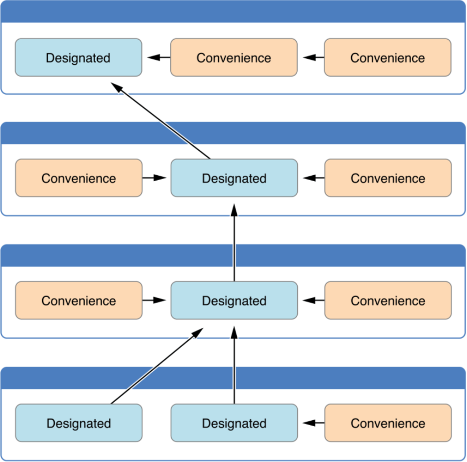
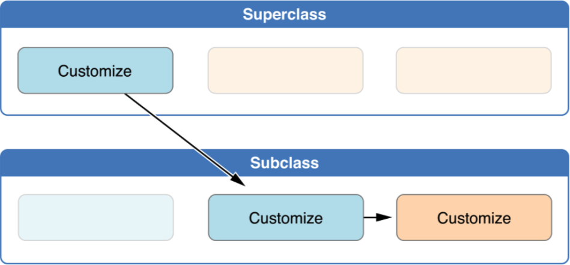

#初始化
---
初始化是为类、结构体或者枚举准备实例的过程。这个过程需要给实例里的每一个存储属性设置一个初始值并且在新实例可以使用之前执行任何其他所必须的配置或初始化。
###为存储属性设置初始化值
在创建类和结构体的实例时必须为所有的存储属性设置一个合适的初始值。存储属性不能遗留在不确定的状态中。
####初始化器
	struct Fahrenheit {
	    var temperature: Double
	    init() {
	        temperature = 32.0
	    }
	}
	var f = Fahrenheit()
	print("The default temperature is \(f.temperature)° Fahrenheit")
	// prints "The default temperature is 32.0° Fahrenheit"
####默认的属性值
	struct Fahrenheit {
	    var temperature = 32.0
	}
###自定义初始化	
通过输入形式参数和可选类型来自定义初始化过程，或者在初始化的时候分配常量属性。
####初始化形式参数
	struct Celsius {
	    var temperatureInCelsius: Double
	    init(fromFahrenheit fahrenheit: Double) {
	        temperatureInCelsius = (fahrenheit - 32.0) / 1.8
	    }
	    init(fromKelvin kelvin: Double) {
	        temperatureInCelsius = kelvin - 273.15
	    }
	}
	
	let boilingPointOfWater = Celsius(fromFahrenheit: 212.0)
	// boilingPointOfWater.temperatureInCelsius is 100.0
	let freezingPointOfWater = Celsius(fromKelvin: 273.15)
	// freezingPointOfWater.temperatureInCelsius is 0.0
####形式参数名和实际参数标签
	struct Color {
	    let red, green, blue: Double
	    init(red: Double, green: Double, blue: Double) {
	        self.red   = red
	        self.green = green
	        self.blue  = blue
	    }
	    init(white: Double) {
	        red   = white
	        green = white
	        blue  = white
	    }
	}
	
	let magenta = Color(red: 1.0, green: 0.0, blue: 1.0)
	let halfGray = Color(white: 0.5)
	
	let veryGreen = Color(0.0, 1.0, 0.0)
	// this reports a compile-time error - external names are required
####无实际参数标签的初始化器形式参数
	struct Celsius {
	    var temperatureInCelsius: Double
	    init(fromFahrenheit fahrenheit: Double) {
	        temperatureInCelsius = (fahrenheit - 32.0) / 1.8
	    }
	    init(fromKelvin kelvin: Double) {
	        temperatureInCelsius = kelvin - 273.15
	    }
	    init(_ celsius: Double) {
	        temperatureInCelsius = celsius
	    }
	}
	
	let bodyTemperature = Celsius(37.0)
	// bodyTemperature.temperatureInCelsius is 37.0
####可选属性类型
	class SurveyQuestion {
	    var text: String
	    var response: String?
	    init(text: String) {
	        self.text = text
	    }
	    func ask() {
	        print(text)
	    }
	}
	
	let cheeseQuestion = SurveyQuestion(text: "Do you like cheese?")
	cheeseQuestion.ask()
	// prints "Do you like cheese?"
	cheeseQuestion.response = "Yes, I do like cheese."
####在初始化中分配常量属性
在初始化的任意时刻，你都可以给常量属性赋值，只要它在初始化结束是设置了确定的值即可。一旦为常量属性被赋值，它就不能再被修改了。

	class SurveyQuestion {
	    let text: String
	    var response: String?
	    init(text: String) {
	        self.text = text
	    }
	    func ask() {
	        print(text)
	    }
	}
	let beetsQuestion = SurveyQuestion(text: "How about beets?")
	beetsQuestion.ask()
	// prints "How about beets?"
	beetsQuestion.response = "I also like beets. (But not with cheese.)"
###默认初始化器
Swift 为所有没有提供初始化器的结构体或类提供了一个默认的初始化器来给所有的属性提供了默认值。这个默认的初始化器只是简单地创建了一个所有属性都有默认值的新实例。

	class ShoppingListItem {
	    var name: String?
	    var quantity = 1
	    var purchased = false
	}
	var item = ShoppingListItem()
###值类型的初始化器委托
初始化器可以调用其他初始化器来执行部分实例的初始化。这个过程，就是所谓的初始化器委托，避免了多个初始化器里冗余代码。

	struct Size {
	    var width = 0.0, height = 0.0
	}
	
	struct Point {
	    var x = 0.0, y = 0.0
	}
	
	struct Rect {
	    var origin = Point()
	    var size = Size()
	    init() {}
	    init(origin: Point, size: Size) {
	        self.origin = origin
	        self.size = size
	    }
	    init(center: Point, size: Size) {
	        let originX = center.x - (size.width / 2)
	        let originY = center.y - (size.height / 2)
	        self.init(origin: Point(x: originX, y: originY), size: size)
	    }
	}
	
	let basicRect = Rect()
	// basicRect's origin is (0.0, 0.0) and its size is (0.0, 0.0)
	
	let originRect = Rect(origin: Point(x: 2.0, y: 2.0), 
		size: Size(width: 5.0, height: 5.0))
	// originRect's origin is (2.0, 2.0) and its size is (5.0, 5.0)
	
	let centerRect = Rect(center: Point(x: 4.0, y: 4.0),
    	size: Size(width: 3.0, height: 3.0))
	// centerRect's origin is (2.5, 2.5) and its size is (3.0, 3.0)
###类的继承和初始化	
所有类的存储属性——包括从它的父类继承的所有属性——都必须在初始化期间分配初始值。Swift 为类类型定义了两种初始化器以确保所有的存储属性接收一个初始值。这些就是所谓的指定初始化器和便捷初始化器。
####指定初始化器和便捷初始化器
指定初始化器是类的主要初始化器。指定的初始化器可以初始化所有那个类引用的属性并且调用合适的父类初始化器来继续这个初始化过程给父类链。

	init(parameters) {
	    statements
	}
便捷初始化器是次要的，为一个类支持初始化器。你可以在相同的类里定义一个便捷初始化器来调用一个指定的初始化器作为便捷初始化器来给指定初始化器设置默认形式参数。你也可以为具体的使用情况或输入的值类型定义一个便捷初始化器从而创建这个类的实例。

	convenience init(parameters) {
	    statements
	}
####类类型的初始化器委托
- 规则1：指定初始化器必须从它的直系父类调用指定初始化器
- 规则2：便捷初始化器必须从相同的类里调用另一个初始化器
- 规则3：便捷初始化器最终必须调用一个指定初始化器
- 总结： 指定初始化器必须总是向上委托，便捷初始化器必须总是横向委托

####两段式初始化
- 安全检查1：指定初始化器必须保证在向上委托给父类初始化器之前，其所在类引入的所有属性都要初始化完成
- 安全检查2：指定初始化器必须先向上委托父类初始化器，然后才能为继承的属性设置新值
- 安全检查3：便捷初始化器必须先委托同类中的其它初始化器，然后再为任意属性赋新值（包括同类里定义的属性）
- 安全检查4：初始化器在第一阶段初始化完成之前，不能调用任何实例方法、不能读取任何实例属性的值，也不能引用 self 作为值

#####阶段1

#####阶段2

####初始化器的继承和重写
子类不会默认继承父类的初始化器

	class Vehicle {
	    var numberOfWheels = 0
	    var description: String {
	        return "\(numberOfWheels) wheel(s)"
	    }
	}
	
	class Bicycle: Vehicle {
	    override init() {
	        super.init()
	        numberOfWheels = 2
	    }
	}
	
	let bicycle = Bicycle()
	print("Bicycle: \(bicycle.description)")
	// Bicycle: 2 wheel(s)
####自动初始化器的继承
子类默认不会继承父类初始化器，在特定的情况下父类初始化器是可以被自动继承的

- 规则1：如果你的子类没有定义任何指定初始化器，它会自动继承父类所有的指定初始化器
- 规则2：如果你的子类提供了所有父类指定初始化器的实现——要么是通过规则1继承来的，要么通过在定义中提供自定义实现的——那么它自动继承所有的父类便捷初始化器

####指定和便捷初始化器的操作
	class Food {
	    var name: String
	    init(name: String) {
	        self.name = name
	    }
	    convenience init() {
	        self.init(name: "[Unnamed]")
	    }
	}
	
	class RecipeIngredient: Food {
	    var quantity: Int
	    init(name: String, quantity: Int) {
	        self.quantity = quantity
	        super.init(name: name)
	    }
	    override convenience init(name: String) {
	        self.init(name: name, quantity: 1)
	    }
	}
	
	let oneMysteryItem = RecipeIngredient()
	let oneBacon = RecipeIngredient(name: "Bacon")
	let sixEggs = RecipeIngredient(name: "Eggs", quantity: 6)
	
	class ShoppingListItem: RecipeIngredient {
	    var purchased = false
	    var description: String {
	        var output = "\(quantity) x \(name)"
	        output += purchased ? " ✔" : " ✘"
	        return output
	    }
	}
	
	var breakfastList = [
	    ShoppingListItem(),
	    ShoppingListItem(name: "Bacon"),
	    ShoppingListItem(name: "Eggs", quantity: 6),
	]
	breakfastList[0].name = "Orange juice"
	breakfastList[0].purchased = true
	for item in breakfastList {
	    print(item.description)
	}
	// 1 x Orange juice ✔
	// 1 x Bacon ✘
	// 6 x Eggs ✘

###可失败初始化器	

	struct Animal {
	    let species: String
	    init?(species: String) {
	        if species.isEmpty { return nil }
	        self.species = species
	    }
	}
	
	let someCreature = Animal(species: "Giraffe")
	// someCreature is of type Animal?, not Animal
	if let giraffe = someCreature {
	    print("An animal was initialized with a species of \(giraffe.species)")
	}
	// prints "An animal was initialized with a species of Giraffe"
	
	let anonymousCreature = Animal(species: "")
	// anonymousCreature is of type Animal?, not Animal
	if anonymousCreature == nil {
	    print("The anonymous creature could not be initialized")
	}
	// prints "The anonymous creature could not be initialized"
	
####枚举的可失败初始化器

	enum TemperatureUnit {
	    case Kelvin, Celsius, Fahrenheit
	    init?(symbol: Character) {
	        switch symbol {
	        case "K":
	            self = .Kelvin
	        case "C":
	            self = .Celsius
	        case "F":
	            self = .Fahrenheit
	        default:
	            return nil
	        }
	    }
	}	
	
	let fahrenheitUnit = TemperatureUnit(symbol: "F")
	if fahrenheitUnit != nil {
	    print("This is a defined temperature unit, so initialization succeeded.")
	}
	// prints "This is a defined temperature unit, so initialization succeeded."
	let unknownUnit = TemperatureUnit(symbol: "X")
	
	if unknownUnit == nil {
	    print("This is not a defined temperature unit, so initialization failed.")
	}
	// prints "This is not a defined temperature unit, so initialization failed."
	
####带有原始值枚举的可失败初始化器

带有原始值的枚举会自动获得一个可失败初始化器 init?(rawValue:) ，该可失败初始化器接收一个名为 rawValue 的合适的原始值类型形式参数如果找到了匹配的枚举情况就选择其一，或者没有找到匹配的值就触发初始化失败	

	enum TemperatureUnit: Character {
	    case Kelvin = "K", Celsius = "C", Fahrenheit = "F"
	}
	 
	let fahrenheitUnit = TemperatureUnit(rawValue: "F")
	if fahrenheitUnit != nil {
	    print("This is a defined temperature unit, so initialization succeeded.")
	}
	// prints "This is a defined temperature unit, so initialization succeeded."
	 
	let unknownUnit = TemperatureUnit(rawValue: "X")
	if unknownUnit == nil {
	    print("This is not a defined temperature unit, so initialization failed.")
	}
	// prints "This is not a defined temperature unit, so initialization failed."
	
####初始化失败的传递

类，结构体或枚举的可失败初始化器可以横向委托到同一个类，结构体或枚举里的另一个可失败初始化器。类似地，子类的可失败初始化器可以向上委托到父类的可失败初始化器。

无论哪种情况，如果你委托到另一个初始化器导致了初始化失败，那么整个初始化过程也会立即失败，并且之后任何初始化代码都不会执行。	

	class Product {
	    let name: String
	    init?(name: String) {
	        if name.isEmpty { return nil }
	        self.name = name
	    }
	}
	 
	class CartItem: Product {
	    let quantity: Int
	    init?(name: String, quantity: Int) {
	        if quantity < 1 { return nil }
	        self.quantity = quantity
	        super.init(name: name)
	    }
	}
	
	if let twoSocks = CartItem(name: "sock", quantity: 2) {
	    print("Item: \(twoSocks.name), quantity: \(twoSocks.quantity)")
	}
	// prints "Item: sock, quantity: 2"
	
	if let zeroShirts = CartItem(name: "shirt", quantity: 0) {
	    print("Item: \(zeroShirts.name), quantity: \(zeroShirts.quantity)")
	} else {
	    print("Unable to initialize zero shirts")
	}
	// prints "Unable to initialize zero shirts"
	
	if let oneUnnamed = CartItem(name: "", quantity: 1) {
	    print("Item: \(oneUnnamed.name), quantity: \(oneUnnamed.quantity)")
	} else {
	    print("Unable to initialize one unnamed product")
	}
	// prints "Unable to initialize one unnamed product"
	
####重写可失败初始化器	

可以用子类的非可失败初始化器来重写父类可失败初始化器，用非可失败的子类初始化器重写了一个可失败初始化器，向上委托到父类初始化器的唯一办法是强制展开父类可失败初始化器的结果

	class Document {
	    var name: String?
	    // this initializer creates a document with a nil name value
	    init() {}
	    // this initializer creates a document with a non-empty name value
	    init?(name: String) {
	        self.name = name
	        if name.isEmpty { return nil }
	    }
	}
	
	class AutomaticallyNamedDocument: Document {
	    override init() {
	        super.init()
	        self.name = "[Untitled]"
	    }
	    override init(name: String) {
	        super.init()
	        if name.isEmpty {
	            self.name = "[Untitled]"
	        } else {
	            self.name = name
	        }
	    }
	}
	
	class UntitledDocument: Document {
	    override init() {
	        super.init(name: "[Untitled]")!
	    }
	}
	
###必要初始化器

在类的初始化器前添加 required  修饰符来表明所有该类的子类都必须实现该初始化器

当子类重写父类的必要初始化器时，必须在子类的初始化器前同样添加 required 修饰符以确保当其它类继承该子类时，该初始化器同为必要初始化器。在重写父类的必要初始化器时，不需要添加 override 修饰符

	class SomeClass {
	    required init() {
	        // initializer implementation goes here
	    }
	}
	
	class SomeSubclass: SomeClass {
	    required init() {
	        // subclass implementation of the required initializer goes here
	    }
	}
	
###通过闭包和函数来设置属性的默认值

如果某个存储属性的默认值需要自定义或设置，你可以使用闭包或全局函数来为属性提供默认值。当这个属性属于的实例初始化时，闭包或函数就会被调用，并且它的返回值就会作为属性的默认值

	class SomeClass {
	    let someProperty: SomeType = {
	        // create a default value for someProperty inside this closure
	        // someValue must be of the same type as SomeType
	        return someValue
	    }()
	}	